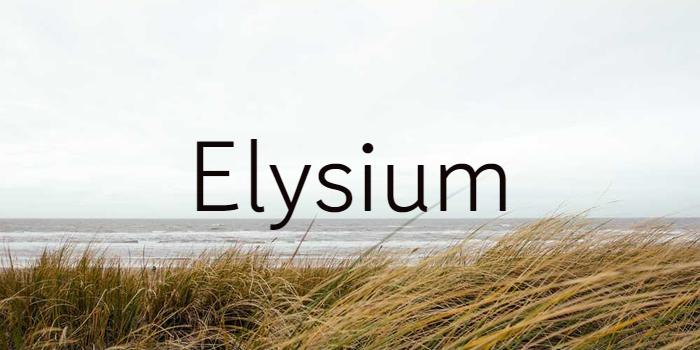
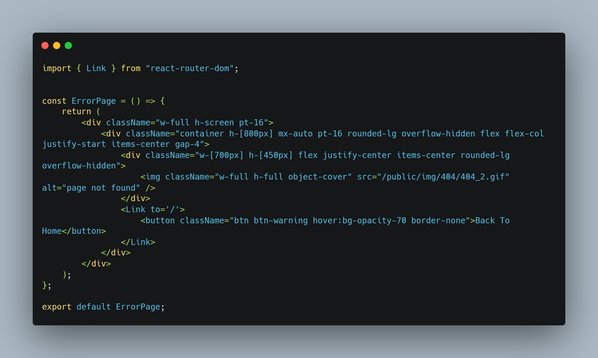

# Elysium | Restaurant

Welcome to Elysium – a full-stack web application designed for restaurant owners and food enthusiasts. This project focuses on providing a visually appealing and user-friendly platform to manage food items, explore culinary delights, and enhance the overall dining experience.

## Live Website

Explore Elysium on our [live website](https://elysium-5dc18.web.app).

## Main Features

- **View Food Items**: Users can browse and view a list of available food items, including details like food name, image, category, price, and more.

- **Detailed Food Item Info**: Users can click on a food item to see in-depth information, including the food's name, image, category, price, creator, origin, and a short description.

- **Add Food Item**: Registered users can easily add new food items to the database, providing details such as name, image, category, quantity, price, creator, origin, and a description.

- **Order Food Item**: Users can conveniently order food items by selecting the desired quantity, with built-in checks to ensure availability and quantity limits. Orders are associated with the logged-in user for tracking.

- **User Profile**: Users have access to their profile, allowing them to view their added food items, add new food items to the menu, and review their ordered food items.

